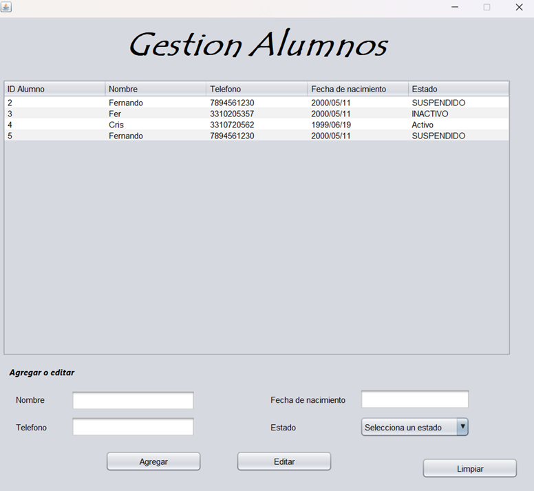
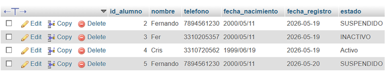

# Mictlan Academy Manager

A student management system developed using **Java** and **MySQL**, designed to streamline student administration for academies.

##  Tech Stack
* **Language:** Java
* **Database:** MySQL
* **Database Connectivity:** JDBC
* **Build Automation:** Maven
* **Graphical User Interface (GUI):** Swing

##  Key Features
* **Student Registration:** Seamlessly add new students to the database.
* **Data Visualization:** View complete student records within a dynamic UI table.
* **Information Editing:** Quickly update and modify student data.
* **Table Row Selection:** Select a record directly from the table UI for fast editing.
* **Status Management:** Manage student academic/behavioral standings:
  * `Active`
  * `Inactive`
  * `Suspended`
  * `Banned`
* **Automated Timestamps:** Registration dates are automatically generated and handled by the system upon creation.

##  Stored Information
The system securely persists the following data fields for each student:
* **Full Name**
* **Phone Number**
* **Date of Birth**
* **Current Status**
* **Enrollment Date** *(System-generated)*

## Project Core Objectives
This project was engineered to practically apply and master the following core software concepts:
* **Object-Oriented Programming (OOP)** principles.
* **Java Backend Development** architecture.
* **Database Connectivity** using native JDBC drivers.
* **CRUD Operations** implementation.
* Data persistence and manipulation via **MySQL**.

## 🔮 Future Roadmap (Upcoming Enhancements)
* [ ] Advanced student search and filtering options.
* [ ] Course and class schedule management.
* [ ] Daily attendance tracking control.
* [ ] Automated student reporting tools.
* [ ] Payment processing and tuition tracking.
* [ ] Enrollment analytics and performance metrics dashboard.

## Author
* **Cristian Domínguez** - *Software Engineering Student at UNEDL*

## Capturas de pantalla

### Interfaz principal

### Tabla de alumnos

&#x20;Tabla de alumnos

!\[Tabla de alumnos](Images/Tabla.png)

